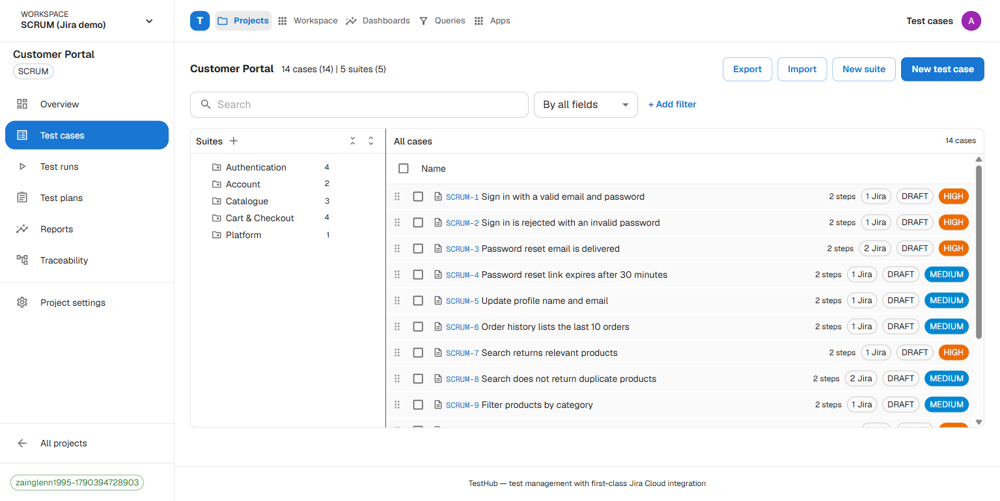
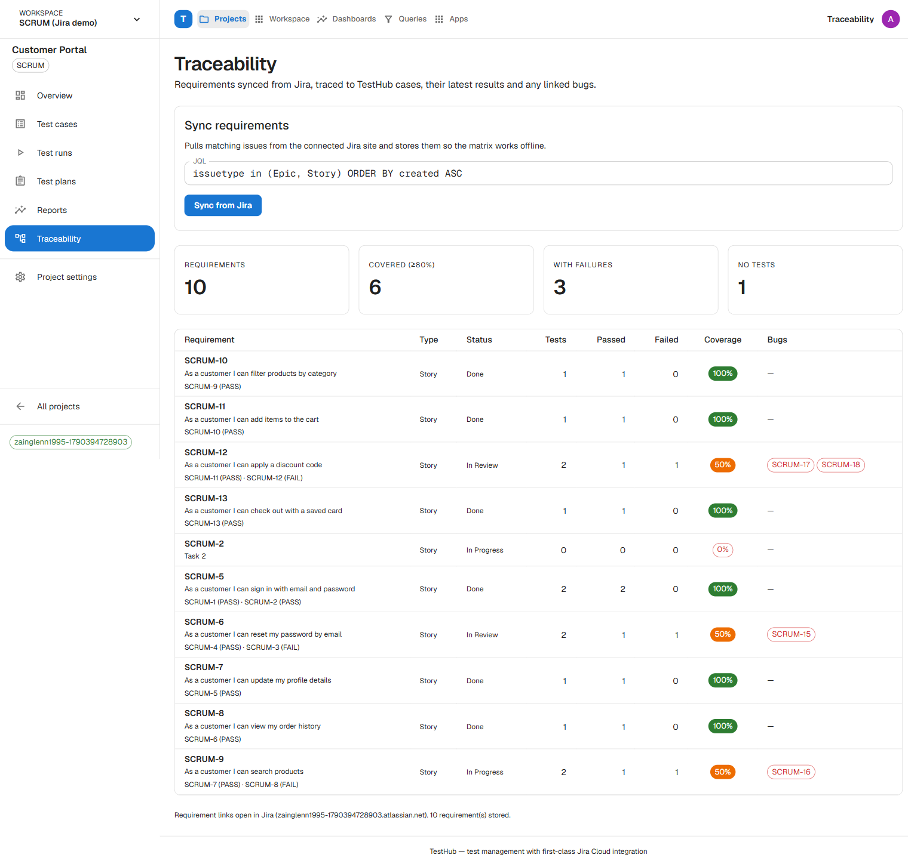
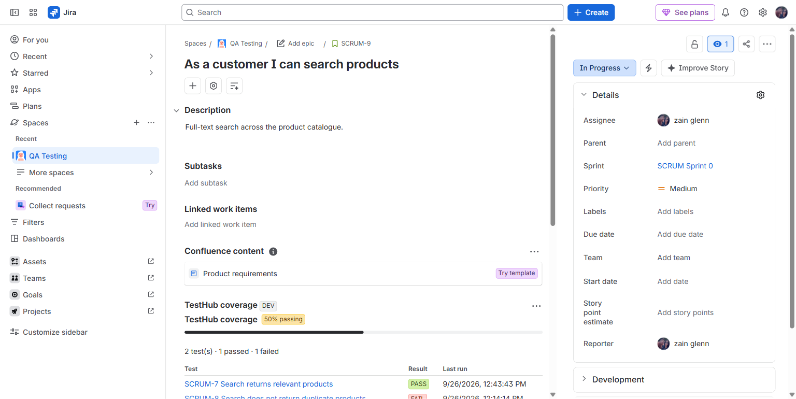
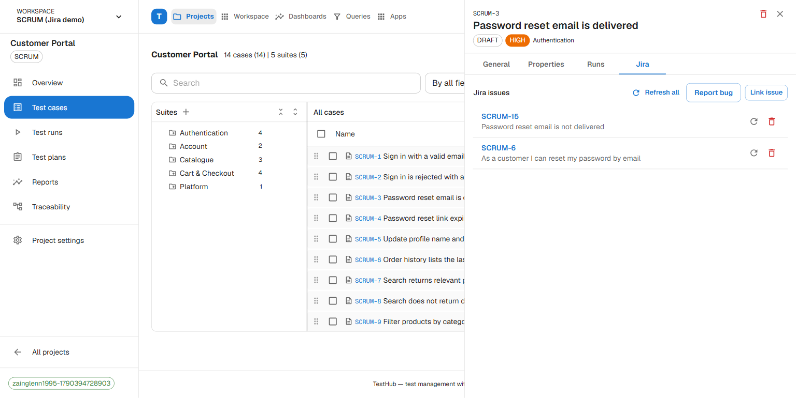
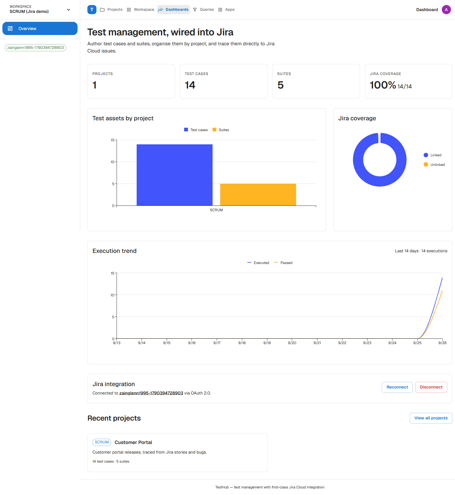

# TestHub

[](https://github.com/zainglenn/testhub/actions/workflows/ci.yml)
[](./LICENSE)
[](https://nextjs.org)
[](./CONTRIBUTING.md)

A test management tool with a first-class [Jira Cloud](https://www.atlassian.com/software/jira) integration.

Author test cases and organise them into nested suites, then trace them to Jira
issues directly from each case. Tokens are stored locally and refreshed
automatically.

## Features (v1)

- **Projects** — group suites and test cases under a key (e.g. `EPP`).
- **Nested suites** — build a hierarchy and filter cases per suite.
- **Test cases + steps** — title, description, preconditions, priority, status,
  and ordered steps with expected results (add / edit / reorder / delete).
- **Jira Cloud OAuth 2.0 (3LO)** — connect an Atlassian account, refresh tokens
  automatically, and disconnect at any time.
- **Issue linking & traceability** — search issues by text or key, link them to a
  test case, refresh their metadata, unlink, and see per-project Jira coverage.
- **Traceability matrix** — pull requirements from Jira with a JQL query and trace
  them to their tests, latest results and linked bugs (Requirement → Tests →
  Results → Bugs).
- **Parameterized cases** — attach workspace parameters to a test case and record
  a result per dataset (data-driven execution).
- **Jira status write-back** — optionally transition linked issues on pass/fail
  (configured per project by target status name).
- **Dashboard** — sidebar-driven shell, overview stat cards, a test-assets-per-project
  bar chart, and a Jira coverage donut (MUI X Charts).
- **Sortable case grid** — the project case list is a MUI X DataGrid with sorting,
  pagination and status/priority chips.
- **CSV import / export** — round-trip the repository; nested suites via `Parent / Child`.
- **CI results ingestion** — push JUnit XML into runs via a project API token.

## Screenshots

**Test repository with per-case Jira links**



**Traceability matrix** — requirements from Jira → tests → results → bugs



**Embedded Jira issue panel** — coverage inside the issue (Forge app)



**Linked issues on a case**



**Dashboard** — coverage and execution trends



## Stack

- [Next.js 16](https://nextjs.org) (App Router, Server Components + Server Functions)
- TypeScript
- [Prisma 7](https://www.prisma.io) with PostgreSQL via the `@prisma/adapter-pg` driver adapter
- [Supabase](https://supabase.com) for Postgres + object storage (attachments)
- [Material UI v9](https://mui.com/material-ui/) (with Emotion and the App Router cache provider)
- [MUI X v9](https://mui.com/x/) (`@mui/x-charts`, `@mui/x-data-grid`)
- Zod for input validation

## Getting started

Requires Node.js 20.9+ and a PostgreSQL database (Supabase works; set
`DATABASE_URL` and `DIRECT_URL` in `.env` — see **Deploy** for the Supabase
values).

```bash
npm install
cp .env.example .env   # Windows: copy .env.example .env  (then fill DATABASE_URL/DIRECT_URL)
npm run db:migrate     # apply the Postgres migrations (uses DIRECT_URL)
npm run db:seed        # create the default admin user + workspace
npm run db:import:epp  # sync the EPP Gauge suite (safe to re-run)
npm run dev
```

Open http://localhost:3000.

You will be redirected to `/login`. Accounts are stored locally with
scrypt-hashed passwords. The seed creates an admin account
(`admin@testhub.dev` by default) and prints a **randomly generated password**
once — copy it, or set `SEED_ADMIN_PASSWORD` / `SEED_ADMIN_EMAIL` to choose your
own before running `db:seed`.

There is no public sign-up; admins manage accounts from the **Users** page.
Editing and running tests records attribution (created by / executed by). Swap
in an external identity provider before production.

The app runs without Jira configured — the Jira panels simply prompt you to set
up credentials.

## Connecting Jira Cloud (OAuth 2.0)

1. Go to the [Atlassian Developer console](https://developer.atlassian.com/console/myapps/)
   and choose **Create** → **OAuth 2.0 (3LO) integration**.
2. Open **Permissions** and add the Jira platform REST API scopes:
   - `read:jira-work`
   - `read:jira-user`
   - `write:jira-work` (to post result comments back to issues)
   - `offline_access` (required to refresh tokens)
3. Open **Authorization** and set the callback URL to exactly:
   ```
   http://localhost:3000/api/jira/oauth/callback
   ```
4. Copy the **Client ID** and **Secret** into `.env`:
   ```bash
   JIRA_CLIENT_ID="your-client-id"
   JIRA_CLIENT_SECRET="your-client-secret"
   APP_BASE_URL="http://localhost:3000"
   ```
5. Restart the dev server and click **Connect Jira Cloud** on the dashboard.

Connections are scoped to the **active workspace** — connect Jira once per
workspace (the OAuth round-trip remembers which workspace started it).

When you change `APP_BASE_URL`, update the callback URL in the Atlassian console
to `<APP_BASE_URL>/api/jira/oauth/callback`.

### Demo workspace

`npm run db:seed:scrum` creates a second workspace named **SCRUM (Jira demo)**
(owner: the seeded admin) with a `SCRUM` project, two suites, six test cases
linked to `SCRUM-1`…`SCRUM-6`, and an open run where three pass and one fails.
Switch to it from the sidebar workspace switcher. It exercises the linked-issue
list, the coverage API (`?key=SCRUM-3`), result comments and **Report bug**.

Point it at your real Jira site by connecting Jira (above) while that workspace
is active — Jira connections are **per-workspace**, so this demo workspace owns
its own SCRUM connection independently of every other workspace. The seeded
issue keys are placeholders: relink real issues (or edit them) if your `SCRUM`
project uses different keys.

### Two-way sync

- **Outbound (TestHub → Jira).** Recording a result on a test case posts a short
  comment to each linked issue, and completing a run posts a one-line summary of
  the run's results. This is best-effort: if Jira is unreachable the local result
  still saves. Requires the `write:jira-work` scope — reconnect if your existing
  connection predates it.
- **Report a bug.** In a test case's **Jira issues** section, **Report bug**
  creates a Jira bug via `POST /rest/api/3/issue` (project key + issue type,
  prefilled summary and description from the case and its latest failed result)
  and links it to the case. Also gated on `write:jira-work`.
- **Status write-back.** In a project's **Settings → Jira status write-back**,
  set target status names for pass/fail (e.g. `Done`, `Reopen`). When a result is
  recorded, linked issues are transitioned to the matching status — resolved
  against each issue's available transitions by destination status name, so it
  works across workflows. Leave blank to disable.
- **Inbound (Jira → TestHub).** `POST /api/jira/webhook` re-fetches an issue and
  refreshes its cached summary/status when it changes in Jira. Set
  `JIRA_WEBHOOK_SECRET`, then in Jira go to **Settings → System → WebHooks** and
  create a webhook for the issue *created*/*updated* events pointing at
  `${APP_BASE_URL}/api/jira/webhook?secret=<secret>` (the `x-jira-webhook-secret`
  header is also accepted). Without the secret the endpoint returns 503.
- **Scheduled sync.** A daily Vercel Cron (`vercel.json` →
  `GET /api/cron/jira-sync`) refreshes linked-issue metadata and re-syncs every
  project's stored requirements, so links stay current without manual refreshes.
  It is authorised with `CRON_SECRET` (Vercel sends it as a bearer token); you can
  also trigger it by hand with `?secret=<CRON_SECRET>`.

### Coverage API (embedded Jira panel)

`GET /api/v1/jira/coverage?key=SCRUM-123` (or `?issueId=<id>`) returns the tests
linked to a requirement, their latest result, linked bugs and recent runs — the
feed an embedded Jira issue panel renders. Auth is a bearer token: set
`JIRA_PANEL_SECRET` and send it directly, or send an HS256 JWT signed with it
(the `exp` claim is honoured). The endpoint returns 503 when the secret is unset
and 401 on a bad token. CORS is open for GET, so a browser-based panel can call it.

```json
{
  "issue": { "issueKey": "SCRUM-123", "summary": "…", "status": "In Progress", "url": "https://<site>/browse/SCRUM-123" },
  "summary": { "total": 7, "passed": 5, "failed": 1, "blocked": 0, "skipped": 0, "untested": 1, "coverage": 71 },
  "tests": [{ "key": "EPP-12", "title": "…", "status": "FAILED", "lastExecutedAt": "…", "project": {}, "suite": {} }],
  "linkedBugs": [{ "issueKey": "SCRUM-900", "summary": "…", "status": "Open" }],
  "recentRuns": [{ "id": "…", "name": "…", "status": "COMPLETED", "environment": "Staging", "completedAt": "…" }],
  "generatedAt": "…"
}
```

```bash
curl -H "Authorization: Bearer $JIRA_PANEL_SECRET" \
  "http://localhost:3000/api/v1/jira/coverage?key=SCRUM-123"
```

## Scripts

| Script | Description |
| --- | --- |
| `npm run dev` | Start the development server |
| `npm run build` | Production build |
| `npm start` | Start the production server |
| `npm run lint` | Run ESLint |
| `npm run typecheck` | Generate route types and run `tsc --noEmit` |
| `npm test` | Run the Vitest unit test suite |
| `npm run db:migrate` | Create/apply Prisma migrations |
| `npm run db:push` | Push the schema without a migration (prototyping) |
| `npm run db:seed` | Create the default admin user and workspace |
| `npm run db:import:epp` | Sync the EPP Gauge suite (re-runnable; `-- --reset` rebuilds it) |
| `npm run db:import:gauge` | Import any Gauge project's `.spec` files (set `GAUGE_SOURCE`) |
| `npm run db:import:ado` | Import Azure DevOps Test Cases (set `ADO_ORG`/`ADO_PROJECT`/`ADO_PAT`) |
| `npm run db:studio` | Open Prisma Studio |
| `npm run db:generate` | Regenerate the Prisma client |

## Navigation

The top bar is a mode switcher; each mode has its own sidebar:

| Mode | Sidebar |
| --- | --- |
| **Projects** | All projects → inside a project: Overview / Test cases / Test runs / Test plans / Reports / Traceability / Settings |
| **Workspace** | Users, Groups, Roles, Fields, Parameters, Shared steps, Tags, Attachments, Audit log, Single sign-on |
| **Dashboards** | Overview (charts + stats) |
| **Queries** | Saved queries (placeholder) |
| **Apps** | Integrations (Jira, API tokens) |

Workspace administration is restricted to `ADMIN` users. Roles are enforced
through a small permission catalog (`workspace.manage`, `project.manage`,
`case.manage`, `run.manage`): assign a role to each user on the **Users** page,
and `ADMIN` accounts implicitly hold every permission. Attachments are stored in
a **Supabase Storage** bucket (`SUPABASE_STORAGE_BUCKET`, default `attachments`).

### Multi-tenant workspaces

Every project, test case, run, tag, field and setting belongs to a **workspace**.
A user can be a member of several workspaces with a different role in each.

- The active workspace is resolved per request from the `workspace_id` cookie,
  validated against the signed-in user's memberships (`getWorkspace()` in
  `src/lib/workspace.ts`); it falls back to the user's first membership.
- Switch workspaces from the switcher at the top of the sidebar, or create a new
  one under **New workspace** (the creator becomes its owner).
- The **Users** page lists only members of the active workspace and adds new
  accounts to it; role changes apply to that membership.
- Admins can **invite by email** from the Users page: an existing account is
  added to the workspace immediately, while a new person gets a one-time join
  link (`/invite/<token>`, 7-day expiry) that creates their account, membership
  and session. Email delivery is not configured, so the link is shown to copy.
  Pending invitations can be revoked, and members removed from a workspace
  without deleting their account.
- Reads are scoped and every project read returns `notFound` for another
  workspace. Write actions (projects, suites, cases, steps, runs, executions,
  tags, API tokens, attachments, Jira links and all workspace settings) verify
  that the target belongs to the active workspace before mutating.

After upgrading an existing database, run `npm run db:backfill:workspaces` once
to assign any legacy projects to the default workspace.

## How it fits together

```
prisma/schema.prisma        Project, TestSuite, TestCase, TestStep,
                            JiraConnection, JiraIssueLink
prisma7.config.ts           Prisma 7 config (schema, migrations, datasource url)
src/generated/prisma        Generated Prisma client (gitignored)

src/lib/prisma.ts           PrismaClient + @prisma/adapter-pg (Postgres)
src/lib/workspace.ts        Active-workspace resolution + tenant-scope helpers
src/lib/session.ts          Session cookie encode/decode (HMAC)
src/lib/auth-session.ts     Creates a session row + sets the cookie
src/lib/validation.ts       Zod schemas for every form
src/lib/actions/*           Server Functions (projects, suites, cases, jira,
                            members/invitations, workspace settings)
src/lib/jira/config.ts      OAuth scopes, endpoints, env
src/lib/jira/oauth.ts       Authorize URL, code exchange, refresh, resources
src/lib/jira/client.ts      Token-aware Jira REST calls, issue search, refresh

src/theme.ts                MUI theme (light/dark color schemes)
src/components/providers.tsx     AppRouterCacheProvider + ThemeProvider + CssBaseline
src/components/app-shell.tsx     Sidebar drawer + top app bar shell
src/components/dashboard-charts.tsx  MUI X BarChart + PieChart
src/components/cases-table.tsx       MUI X DataGrid for test cases

src/app/api/jira/oauth/start      Redirect to Atlassian authorize
src/app/api/jira/oauth/callback   Exchange code, store connection
src/app/api/jira/issues           Issue search for the picker

src/app                          Dashboard (projects + Jira status)
src/app/projects/[projectId]      Suites, cases, coverage
src/app/cases/[caseId]            Case editor: details, steps, Jira links
```

### CSV import / export

- **Export:** `GET /api/projects/{projectId}/cases/export` (signed-in).
- **Import:** the **Import** button on the repository toolbar.
- Columns: `Title` (required), `Suite`, `Priority`, `Status`, `Preconditions`,
  `Description`, `Tags`, `Steps`.
- Steps are `action => expected` separated by `|`; tags separated by `;`;
  suites nest with `Parent / Child`. Export writes the same format, so exports
  round-trip back in.

### CI results ingestion

Create a token in a project's **Settings → API tokens**, then POST a test report.
The body accepts **one** of `junit` (JUnit XML), `trx` (VSTest/Azure Pipelines
TRX) or `gauge` (Gauge's `--machine-readable` JSON) as a string, plus optional
`runName` and `environment`:

```bash
curl -X POST http://localhost:3000/api/ingest \
  -H "Authorization: Bearer th_your_token" \
  -H "Content-Type: application/json" \
  -d '{"runName":"CI #123","environment":"CI","junit":"<testsuites>...</testsuites>"}'
```

Test cases are matched by key (e.g. `EPP-12`) in the name/classname, falling
back to an exact title match. A completed run is created with the matched
results; the response is `{ runId, matched, unmatched, failed }`.

### Importing existing automation

Turn already-automated tests into a repository without re-authoring:

- **Gauge specs** — `npm run db:import:gauge` (set `GAUGE_SOURCE` to a Gauge
  project root). Each `.spec` scenario becomes a test case and its bullet steps
  become steps; directories under `specs/` become nested suites; `tags:` become
  tags. Re-runnable (upserted by `externalId`).
- **Azure DevOps** — `npm run db:import:ado` (set `ADO_ORG`, `ADO_PROJECT`,
  `ADO_PAT`). Test Case work items are pulled via WIQL; their area path becomes
  suites and the TCM steps become steps.

Their **execution** results are ingested through `POST /api/ingest` with the
`gauge` (machine-readable JSON) or `trx` (VSTest/Azure Pipelines) body key.

### Single sign-on (OIDC)

Enable it under **Workspace → Single sign-on** with your IdP's issuer URL,
client ID and secret, then set the redirect URI there to
`<APP_BASE_URL>/api/sso/callback`. A **Sign in with SSO** button appears on the
login page; the flow discovers endpoints from
`<issuer>/.well-known/openid-configuration`, uses authorization-code + PKCE, and
provisions users on first login (matched by email).

### Jira details

- Authentication uses OAuth 2.0 (3LO). The connection is stored in the
  `JiraConnection` table; the access token is refreshed automatically when it is
  within 60 seconds of expiring.
- Issue search uses `GET /rest/api/3/search/jql` and falls back to the legacy
  `/search` endpoint for older sites.
- Issue keys are validated with `/^[A-Z][A-Z0-9_]*-\d+$/` (e.g. `EPP-123`).

## Roadmap ideas

Workflows beyond these are unplanned — issues and pull requests are welcome.

## Deploy (Vercel + Supabase)

### 1. Supabase (Postgres + Storage)

1. Create a project at [supabase.com](https://supabase.com).
2. **Storage → New bucket**: create a **private** bucket named `attachments`.
3. **Project Settings → Database → Connection string**, then copy:
   - the **Connection pooling** URI (port `6543`) → `DATABASE_URL`
     (append `?pgbouncer=true&connection_limit=1`);
   - the **Direct connection** URI (port `5432`) → `DIRECT_URL`.
4. **Project Settings → API** → copy the Project URL and the `service_role`
   key (server-only) for `SUPABASE_URL` / `SUPABASE_SERVICE_ROLE_KEY`.

### 2. Apply the schema

From a machine with the repo (migrations use `DIRECT_URL`):

```bash
npm run db:migrate     # or: npx prisma migrate deploy
npm run db:seed        # default admin + workspace
```

### 3. Vercel

1. Import the Git repo into Vercel (Next.js is auto-detected).
2. Add environment variables (Production **and** Preview): `DATABASE_URL`,
   `DIRECT_URL`, `AUTH_SECRET`, `APP_BASE_URL` (your Vercel URL),
   `SUPABASE_URL`, `SUPABASE_SERVICE_ROLE_KEY`, optional
   `SUPABASE_STORAGE_BUCKET`, and the `JIRA_*` vars.
3. Deploy. `postinstall` runs `prisma generate`; the build needs no database.
4. Update external callbacks to match `APP_BASE_URL`:
   - Atlassian OAuth callback → `<APP_BASE_URL>/api/jira/oauth/callback`
   - SSO redirect URI → `<APP_BASE_URL>/api/sso/callback`

Health check: `GET /api/health`.

### Environment

| Variable | Notes |
| --- | --- |
| `DATABASE_URL` | Supabase pooler URI (6543), `?pgbouncer=true`. |
| `DIRECT_URL` | Supabase direct URI (5432) — used by migrations. |
| `AUTH_SECRET` | Required in production; signs session cookies. |
| `ENCRYPTION_KEY` | Encrypts Jira/SSO secrets at rest; keep stable across environments. |
| `APP_BASE_URL` | Absolute public URL (Vercel domain). |
| `SUPABASE_URL` | Supabase project URL (attachments). |
| `SUPABASE_SERVICE_ROLE_KEY` | Server-only storage key. |
| `SUPABASE_STORAGE_BUCKET` | Defaults to `attachments`. |
| `JIRA_*` | Optional Jira integration (see above). |
| `CRON_SECRET` | Authorises the scheduled Jira sync; Vercel Cron sends it automatically. |

### Docker (alternative)

```bash
docker compose up --build   # app + a local Postgres
```

The container runs `prisma migrate deploy` on start (via `DIRECT_URL`), then
`next start`. Set `DIRECT_URL` alongside `DATABASE_URL`.

### Continuous integration

`.github/workflows/ci.yml` runs install → generate → lint → typecheck → test → build.

## Security notes

- Passwords are stored as **scrypt hashes**; sessions are **server-side records**
  that can be revoked (Account → Active sessions, or admin "sign out everywhere").
- Login **locks an account after 5 failed attempts** for 15 minutes.
- Security headers (`X-Frame-Options`, `X-Content-Type-Options`, `Referrer-Policy`,
  `Permissions-Policy`, HSTS) are set in `next.config.ts`.
- `.env` is gitignored and `AUTH_SECRET` is required in production (the dev
  default is rejected).
- Jira OAuth tokens and the SSO client secret are **encrypted at rest**
  (AES-256-GCM) using `ENCRYPTION_KEY` (falls back to `AUTH_SECRET`). Keep that
  key stable and secret; changing it makes stored secrets unreadable.

## Contributing

Contributions are welcome — see [CONTRIBUTING.md](./CONTRIBUTING.md). For
security issues, follow [SECURITY.md](./SECURITY.md) instead of opening a public
issue.

## License

[MIT](./LICENSE) © 2026 Zain Glenn.

